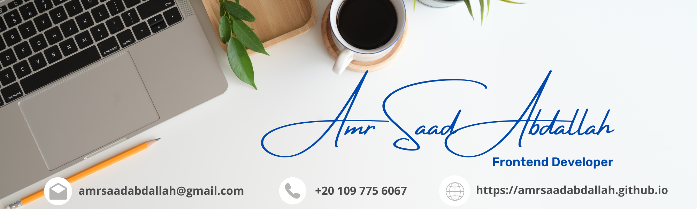

<h1 align="center">  AMR SAAD ABDALLAH GITHUB PROFILE 

---

<h1 align="center">Hello 👋, I'm Amr Saad Abdallah
<h3 align="center" style="font-style:italic">A passionate Frontend developer from Egypt</h3>
</h1>

---

### 🧑 About Me:

- 👨‍💻 **I’m currently working as a freelancer frontend developer and Instructor.**.
- 🌱 **I’m currently self-study**: Typescript & NextJS.
- 💖 **My favorite language: Javascript**.
- 👯 **I’m looking to collaborate on Open Source Projects**.
- 👀 **Have a look on my portofolio**<a href="https://amrsaadabdallah.github.io"> My Website</a>.
- 🔎 **I’m currently open for**: A new job opportunity, contact Me <a href="https://www.linkedin.com/in/amrsaadabdallah">LinkedIn</a>.
- 💼 **Any freelance work?** <a href="mailto:amrsaadabdallah@gmail.com">Email Me</a> with title **"freelance work"**.
- 💬 **Ask me about anything:** <a href="mailto:amrsaadabdallah@gmail.com">Email Me</a> with title **"Ask"** and I will be happy to help you.
- ⚡ **Fun fact**: I love Codeing(💻), Traveling(🌍), Walking(🚶‍♂️) and Cooking(🍕).

---

### 👨‍💻 Profile Overview: </h3>

  Hello, this is <a href="https://amrsaadabdallah.github.io">Amr Saad Abdallah</a> a Frontend developer from Egypt and I have a passion for programming and code, always looking for new tools and improve my skills through continuous self-learning and code a long, design responsive websites using HTML5, CSS3, Sass, Bootstrap, Tailwind CSS, JavaScript, ES6, and also JS frameworks like ReactJS.

  I'm  seeking a job opportunity in a supportive and co-operative environment in Web Development field as a new challenge, where I can utilize my skills and knowledge efficiently for organizational growth and enable me taking significant contribution at the company that I will join and help me to achieve more progress and success.

  I hold Bachelor of Communications Engineering of Fayoum University with Accumulative Grade Very Good with High Honors. And also holds a 9-Month Diploma from Information Technology Institute (ITI), Wireless Communications Track, Suez Canal Branch, Intake 35, and Ranked 1st of the track.  
  My studies in ITI enabled me to work under pressure, Ability to work as an effective team member and individual, the ability to adapt to changing work environments.

  I worked more than three years in RF field at Red Telecom company in Huawei Multi-Vendor Project but I decided to search about a new challenge in a new field as the RF didn't fill my passion I choose “web development” field to be the new challenge. So, I started to invest in myself by taking a frontend diploma at route academy and take training at Eraasoft academy and continuous self-learning from YouTube Tutorials & Udemy courses.

  Plus, I experience of more than 3 years in voluntary work as a Volunteer in “LIFE MAKERS” Organization from 2011, which provided me with how to deal with people and take responsibility and people management and distribution of tasks.

  I joined the Egyptian army and my service period given me patience and bear responsibility, order and discipline and how to deal with top-level.

---

### 🛠️ My Skills

- ##### Languages:
  

    
  &emsp;
  
    &emsp;
  
      &emsp;
  
  <!-- &emsp;
   -->
  

- ##### CSS/UI frameworks :
  

  
  &emsp;
  
  

- ##### JS Libraries :
  

  
  &emsp;
  
    &emsp;
    
    &emsp;
  
  

- ##### Bundling tools
  

  
  &emsp;
  
  

- ##### Formating, Linting & transpiling Tools
  

  
  &emsp;
  
  &emsp;
  
    &emsp;
    
  

- ##### Version control systems:
  

  
  &emsp;
  
  

- ##### Task runners:
  

  
  &emsp;
  
  

- ##### Package Managers:
  

  
  &emsp;
  
  

- ##### IDEs:
  

  
  &emsp;
  
  &emsp;
  
  

- ##### Task manager:
  

  
  &emsp;
  
  &emsp;
  
    &emsp;
  
  

---

### ⚙️ GitHub Analytics

<a href="https://github.com/amrsaadabdallah">
 
  &emsp;
   
  &emsp;
  
  &emsp;
  
</a>

---

### 🏆 Git profile Trophies

  

---

### 👋 Get In Touch:

- [🌐 Website 👉 https://amrsaadabdallah.github.io](https://amrsaadabdallah.github.io)
- [👔 LinkedIn 👉 https://www.linkedin.com/in/amrsaadabdallah](https://www.linkedin.com/in/amrsaadabdallah)
- [🌟 Github 👉 https://github.com/amrsaadabdallah](https://github.com/amrsaadabdallah)
- [📧 Gmail 👉 amrsaadabdallah@gmail.com](mailto:amrsaadabdallah@gmail.com)
- [🐤 Twitter 👉 https://twitter.com/amrsaadabdallah](https://twitter.com/amrsaadabdallah)
- [:phone: Whatsapp 👉 (+20) 109-775-6067](https://api.whatsapp.com/send/?phone=%2B2001097756067&text&type=phone_number&app_absent=0)

---

<a target="_blank" href="https://amrsaadabdallah.github.io">

 2022 &copy; Amr Saad Abdallah 

</a>

